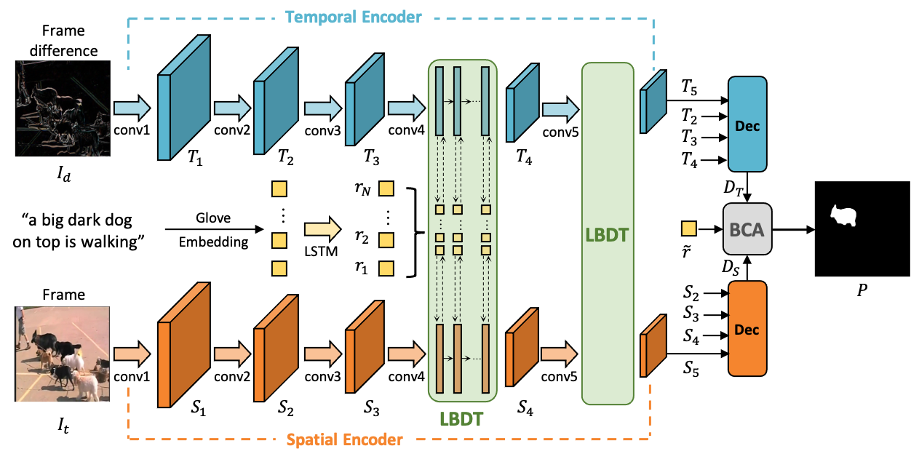

# Language-Bridged Spatial-Temporal Interaction for Referring Video Object Segmentation



> **Language-Bridged Spatial-Temporal Interaction for Referring Video Object Segmentation**, <br>
> [Zihan Ding](https://scholar.google.com/citations?user=czvpD10AAAAJ&hl=zh-TW), [Tianrui Hui](https://scholar.google.com/citations?user=ArjkrTkAAAAJ&hl=zh-TW), [Junshi Huang](https://scholar.google.com.sg/citations?user=FFB6lzQAAAAJ&hl=en), Xiaoming Wei, [Jizhong Han](https://scholar.google.com/citations?user=0b_BPiMAAAAJ&hl=en) and [Si Liu](https://scholar.google.com/citations?user=-QtVtNEAAAAJ&hl=en) <br>
> *CVPR 2022* ([Demo](https://www.youtube.com/watch?v=ECdx871CayA))

## News
* [2022-03-24] Code will come soon.
* [2022-06-08] Update codes.

## Abstract

Referring video object segmentation aims to predict foreground labels for objects referred by natural language expressions in videos. Previous methods either depend on 3D ConvNets or incorporate additional 2D ConvNets as encoders to extract mixed spatial-temporal features. However, these methods suffer from spatial misalignment or false distractors due to delayed and implicit spatial-temporal interaction occurring in the decoding phase. To tackle these limitations, we propose a Language-Bridged Duplex Transfer (LBDT) module which utilizes language as an intermediary bridge to accomplish explicit and adaptive spatial-temporal interaction earlier in the encoding phase. Concretely, cross-modal attention is performed among the temporal encoder, referring words and the spatial encoder to aggregate and transfer language-relevant motion and appearance information. In addition, we also propose a Bilateral Channel Activation (BCA) module in the decoding phase for further denoising and highlighting the spatial-temporal consistent features via channel-wise activation. Extensive experiments show our method achieves new state-of-the-art performances on four popular benchmarks with 6.8% and 6.9% absolute AP gains on A2D Sentences and J-HMDB Sentences respectively, while consuming around 7× less computational overhead.

## Installation

### Requirements

- Linux (CUDA 10.1) or macOS with Python 3.7
- Pytorch == 1.7.1
- Torchvision == 0.8.2

You may use `pip install -r requirements.txt` to install the dependencies.

## Data Preparation

### A2D Sentences 

Download this dataset from [here](https://web.eecs.umich.edu/~jjcorso/r/a2d/). Extract frames and masks from `clips320H/` and `Annotations/col`. Text annotations can be download from [here](https://drive.google.com/drive/folders/1cMJXEKVcxWm_LHSq04rMbHAvh-LcEgub?usp=sharing). We expect the directory structure to be the follows:

```
LBDT
├── datasets
│   ├── a2d
│   │   ├── images
│   │   ├── masks
|   |   ├── train.txt
|   |   ├── val.txt
```

### Refer-Youtube-VOS

Download the dataset from the competition's website [here](https://codalab.lisn.upsaclay.fr/competitions/3282). Text annotations can be download from [here](https://drive.google.com/drive/folders/1cMJXEKVcxWm_LHSq04rMbHAvh-LcEgub?usp=sharing). Then, extract and organize the file. We expect the directory structure to be the following:

```
LBDT
├── datasets
│   ├── ytvos
│   │   ├── train
│   │   ├── val
|   |   ├── train.txt
|   |   ├── val.txt
```

## Training

```bash
sh scripts/train_a2d.sh
sh scripts/train_ytvos.sh
```

## Evaluation

```bash
sh scripts/eval.sh
```

## Performance (w/o RefCOCO Pretraining)

### A2D Sentences

| Method | P@0.5 | P@0.6 | P@0.7 | P@0.8 | P@0.9 | AP   | Overall IoU | Mean IoU  |
| ------ | ----- | ----- | ----- | ----- | ----- | ---- | ----------- | --------  |
| LBDT-1 | 71.1  | 66.1  | 57.8  | 41.6  | 12.0  | 46.1 | 70.1        | 61.2      |
| LBDT-4 | 73.0  | 67.4  | 59.0  | 42.1  | 13.2  | 47.2 | 70.4        | 62.1      |

### J-HMDB Senteces

| Method | P@0.5 | P@0.6 | P@0.7 | P@0.8 | P@0.9 | AP   | Overall IoU | Mean IoU  |
| ------ | ----- | ----- | ----- | ----- | ----- | ---- | ----------- | --------  |
| LBDT-1 | 86.4  | 75.1  | 50.7  | 11.6  | 0.1   | 40.3 | 64.6        | 65.2      |
| LBDT-4 | 86.4  | 74.4  | 53.3  | 12.2  | 0.0   | 41.1 | 64.5        | 65.8      |

### Refer-Youtube-VOS

| Method | J     | F     | J&F   |
| ------ | ----- | ----- | ----- |
| LBDT-4 | 48.18 | 50.57 | 49.38 |

## Citation

```
@inproceedings{Ding_2022_CVPR,
    author    = {Ding, Zihan and Hui, Tianrui and Huang, Junshi and Wei, Xiaoming and Han, Jizhong and Liu, Si},
    title     = {Language-Bridged Spatial-Temporal Interaction for Referring Video Object Segmentation},
    booktitle = {Proceedings of the IEEE/CVF Computer Vision and Pattern Recognition Conference (CVPR)},
    year      = {2022}
```